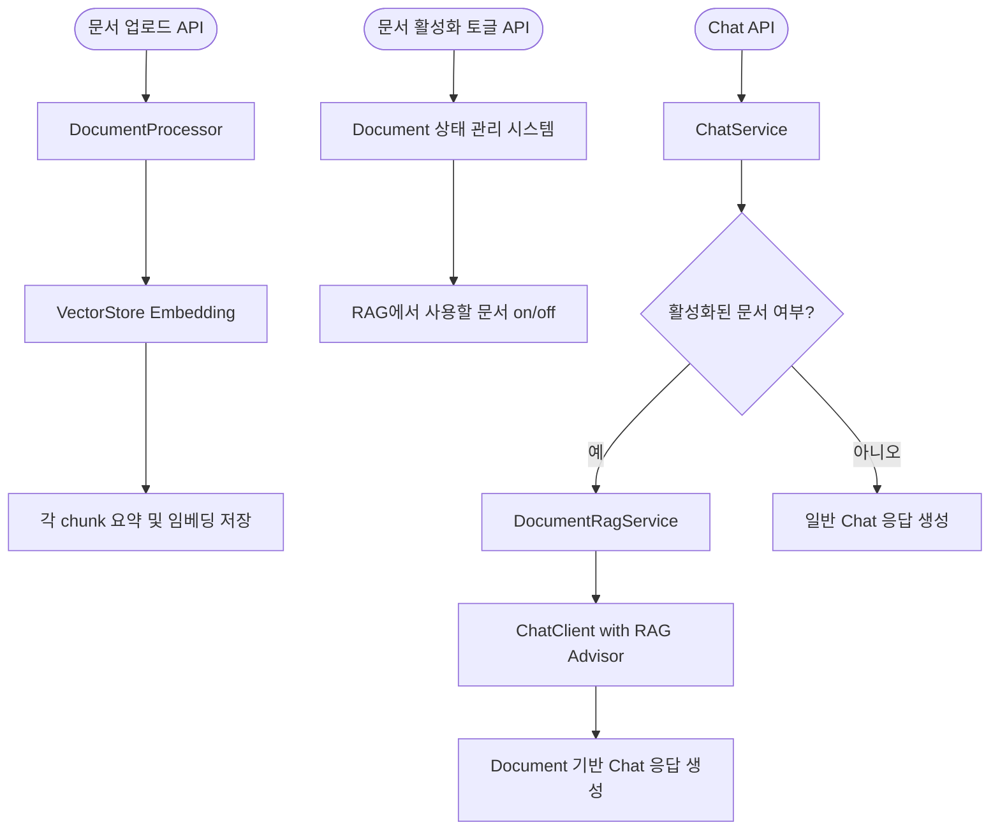

# Spring AI 활용 RAG 기반 Chat Agent

<p align="center">
  
  
  
  
</p>

## 📋 프로젝트 개요

Spring AI 1.0.0을 활용한 RAG(Retrieval-Augmented Generation) 기반 챗봇 서비스입니다. 다양한 형식의 문서를 업로드하고 이를 기반으로 질의응답을 수행할 수 있는 시스템을 제공합니다.
Ollama를 통한 로컬 LLM 모델과 PostgreSQL의 pgvector 확장을 활용한 벡터 저장소를 사용하여 효율적인 문서 검색 및 응답 생성을 구현했습니다.
Agentic 한 시스템으로 개발 중에 있습니다.

## ✨ 주요 기능

### 1. 다양한 문서 형식 지원 (Document ETL Process)
- PDF, 텍스트, JSON 등 다양한 확장자 파일 업로드 지원
- 전략 패턴을 활용한 문서 유형별 처리 전략 구현
- 문서 청크화 및 벡터화 자동 처리

### 2. 고급 RAG 파이프라인
- Spring AI의 RAG 기능을 활용한 문서 기반 질의응답
- 사용자별 문서 관리 및 활성화/비활성화 기능
- 문서 메타데이터 관리 및 검색 필터링

### 3. Modular-RAG 기법 적용
- Retrieval 전 프롬프트 전처리 (Query Expansion)
- Retrieval 후 문서 재랭킹 후처리 (Document Reranking)
- 컨텍스트 기반 응답 생성 최적화

### 4. 기술 스택
- Spring AI 1.0.0 프레임워크 활용
- Ollama를 통한 로컬 LLM 모델 연동
- PgVector를 활용한 벡터 저장소 구현
- Prometheus를 통한 모니터링 시스템 구축

## 🏗️ 시스템 아키텍처

## RAG 시스템 아키텍처



### 주요 플로우 설명

1. **문서 업로드 프로세스**
   - 다양한 형식의 문서를 업로드하면 DocumentProcessor가 문서 유형에 맞게 처리
   - 처리된 문서는 청크로 분할되어 VectorStore에 임베딩과 함께 저장
   - 각 청크의 메타데이터에는 요약 정보도 함께 저장

2. **문서 활성화 관리**
   - 사용자는 RAG에 사용할 문서를 선택적으로 활성화/비활성화 가능
   - 활성화된 문서만 질의응답 시 참조 자료로 활용

3. **채팅 프로세스**
   - 사용자 질의가 Chat API로 전달되면 ChatService가 처리
   - 활성화된 문서가 있는 경우 RetrievalAugmentationAdvisor를 통해 관련 문서 검색 및 활용
   - 활성화된 문서가 없는 경우 일반 LLM 응답 생성

## 🔍 주요 구현 내용

### 1. 모듈형 RAG 아키텍처

```java
public Advisor getRagAdvisor() {
    return RetrievalAugmentationAdvisor.builder()
            .documentRetriever(VectorStoreDocumentRetriever.builder()
                    .similarityThreshold(0.5)
                    .topK(5)
                    .vectorStore(vectorStore)                        
                    .build())
            .queryExpander(multiQueryExpander)
            .documentPostProcessors(customDocumentProcessor)
            .queryAugmenter(queryAugmenter)
            .build();        
}
```

### 2. 문서 처리 전략 패턴

```java
public class DocumentProcessingStrategyFactory {
    
    private final List<DocumentProcessingStrategy> strategies;
    
    public DocumentProcessingStrategyFactory() {
        this.strategies = new ArrayList<>();
        // 전략 등록
        this.strategies.add(new PdfDocumentProcessingStrategy());
        this.strategies.add(new TikaDocumentProcessingStrategy());
        this.strategies.add(new TextDocumentProcessingStrategy());
        this.strategies.add(new JsonDocumentProcessingStrategy());
    }
    
    public DocumentProcessingStrategy getStrategy(Resource resource) {
        for (DocumentProcessingStrategy strategy : this.strategies) {
            if (strategy.canProcess(resource)) {
                return strategy;
            }
        }
        throw new IllegalArgumentException("지원되지 않는 파일 형식");
    }
}
```

## 🚀 시작하기

### 사전 요구사항
- Java 17 이상
- Docker 및 Docker Compose
- Ollama 설치 및 실행

### 설치 및 실행

1. 저장소 클론
```bash
git clone [Repository URL]
cd [Project directory]
```

2. Docker Compose로 필요한 서비스 실행
```bash
docker-compose up -d
```

3. 애플리케이션 빌드 및 실행
```bash
./mvnw clean package
java -jar target/aichat-0.0.1-SNAPSHOT.jar
```

## 📊 모니터링

프로젝트는 Prometheus를 통한 모니터링 시스템을 포함하고 있습니다. 다음 엔드포인트를 통해 모니터링 정보에 접근할 수 있습니다:
**지원 메트릭 참고**
[SpringAI Observability](https://docs.spring.io/spring-ai/reference/observability/index.html)

- Prometheus: http://localhost:9090
- Spring Actuator: http://localhost:8080/actuator

## 📝 API 문서

Swagger UI를 통해 API 문서를 확인할 수 있습니다:

- Swagger UI: http://localhost:8080/swagger-ui.html

## 🔧 환경 설정

`application.yml` 파일에서 다음 설정을 변경할 수 있습니다:

- 서버 포트
- 데이터베이스 연결 정보
- Ollama 모델 설정
- 벡터 저장소 설정
- 문서 처리 파라미터

---

## Future Work

- [ ] Agentic Systems 적용
  - [SpringAI-agentic-patterns](https://spring.io/blog/2025/01/21/spring-ai-agentic-patterns?fbclid=IwY2xjawIMSNJleHRuA2FlbQIxMQABHbPMXc5qsRyrB5zvR5fEgw8Uc11WMjf--_fd2FkmLm-JirNvoqZuxKAdIQ_aem_rX4br-pahDUUqTr3ZlwPYA)
- [ ] 요약 기능
- [ ] MCP Client 적용 및 MCP 서버 연동
